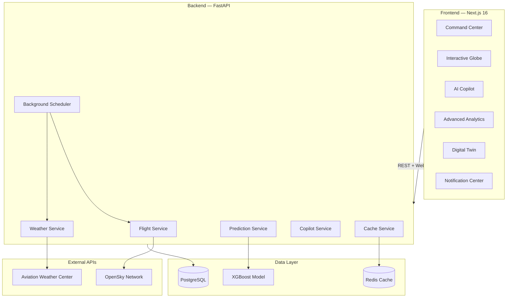

# AeroMind

### AI-Powered Predictive Aviation Operations & Airspace Intelligence Platform

<p align="center">
  <strong>Real-time flight tracking · AI delay predictions · Weather intelligence · Interactive dashboards</strong>
</p>

<p align="center">
  <a href="https://aviation-ai-hamza.vercel.app" target="_blank"><strong>🚀 Live Demo</strong></a>
</p>

---

## What is AeroMind?

AeroMind is a full-stack aviation intelligence platform that gives you a bird's-eye view of global flight operations. Whether you're an aviation professional or just curious about what's happening in the skies — AeroMind makes complex flight data easy to understand.

**What you can do:**

- **Track flights in real-time** — See live aircraft positions on an interactive world map
- **Predict delays with AI** — Our XGBoost model estimates delay risk before you fly (91% accuracy)
- **Check weather conditions** — Plain-English weather reports for 15+ major airports worldwide
- **Ask the AI Copilot** — Natural language assistant ("Will my flight from Chicago be delayed?")
- **Explore analytics** — Airline comparisons, route analysis, historical trends
- **Get notified** — Real-time alerts for weather warnings, delay spikes, and system events
- **Simulate operations** — Digital twin airport simulation with gate and runway status

---

## Architecture



---

## Tech Stack

| Layer          | Technology                                |
|----------------|-------------------------------------------|
| Frontend       | Next.js 16, React 19, TypeScript          |
| Styling        | Tailwind CSS v4, Framer Motion            |
| Visualization  | Canvas 2D, Recharts, SVG Sparklines       |
| Backend        | FastAPI, Python 3.11, Pydantic v2         |
| ML Engine      | XGBoost, scikit-learn, SHAP               |
| Database       | PostgreSQL 16, SQLAlchemy (async)         |
| Cache          | Redis 7                                   |
| Scheduler      | APScheduler                               |
| Container      | Docker, Docker Compose                    |

---

## Quick Start

### Prerequisites

- **Node.js 20+** and **npm 10+**
- **Python 3.11+** (for backend, optional)
- **Docker & Docker Compose** (for full-stack, optional)

### 1. Clone and configure

```bash
git clone <repo-url> && cd "Aviation AI"
cp .env.example .env
# Edit .env with your API keys — all are optional for development
```

### 2. Frontend only (fastest start)

The frontend works completely standalone with built-in mock data:

```bash
cd frontend
npm install
npm run dev -- --port 3001
```

Open **[http://localhost:3001](http://localhost:3001)** — no backend needed!

### 3. Full-stack with Docker

```bash
docker-compose up --build
```

| Service  | URL                                        |
|----------|--------------------------------------------|
| Frontend | [http://localhost:3001](http://localhost:3001) |
| Backend  | [http://localhost:8000](http://localhost:8000) |
| API Docs | [http://localhost:8000/docs](http://localhost:8000/docs) |

### 4. Train the ML Model

```bash
pip install xgboost scikit-learn pandas numpy joblib
python -m ml_models.train_delay_model
```

Outputs `ml_models/trained/delay_model.joblib` (~91% AUC).

---

## Pages & Features

| Page              | Route          | What it does                                              |
|-------------------|----------------|-----------------------------------------------------------|
| Command Center    | `/`            | KPI cards, live globe, activity feed, charts              |
| Flight Tracker    | `/flights`     | Live flight positions with search and filtering           |
| Weather Intel     | `/weather`     | Airport weather reports with risk scoring                 |
| AI Predictions    | `/predictions` | Delay probability estimator with explainability           |
| Airports          | `/airports`    | Airport database with search                              |
| Digital Twin      | `/simulation`  | Airport operations simulator (gates, runways, aircraft)   |
| Advanced Analytics| `/analytics`   | Airline comparison, route analysis, 30-day trends         |

**Always-available components:**
- 🔔 **Notification Center** — Bell icon in the top bar with filter tabs (Urgent / Alerts / Info)
- 💬 **AI Copilot** — Floating chat button (bottom-right) for natural language queries

---

## API Endpoints

| Method | Endpoint                          | Description                |
|--------|-----------------------------------|----------------------------|
| GET    | `/api/v1/flights/live`            | Live flight state vectors  |
| WS     | `/api/v1/flights/ws`              | WebSocket flight stream    |
| GET    | `/api/v1/flights/{icao24}`        | Aircraft details + track   |
| GET    | `/api/v1/weather/metar/{icao}`    | Current weather report     |
| GET    | `/api/v1/weather/risks/{icao}`    | Weather risk scores        |
| POST   | `/api/v1/predictions/delay`       | AI delay prediction        |
| GET    | `/api/v1/predictions/risk-map`    | Global delay risk map      |
| GET    | `/api/v1/airports`                | Airport search & list      |
| GET    | `/api/v1/analytics/summary`       | Dashboard KPIs             |
| POST   | `/api/v1/copilot/chat`            | AI Copilot chat            |
| GET    | `/health`                         | Health check               |

---

## Project Structure

```
Aviation AI/
├── backend/                     # FastAPI application
│   ├── app/
│   │   ├── main.py              # App factory, CORS, lifespan
│   │   ├── config.py            # Pydantic settings
│   │   ├── routers/             # 8 API route modules
│   │   │   ├── flights.py       # REST + WebSocket flights
│   │   │   ├── weather.py       # METAR, TAF, risk
│   │   │   ├── predictions.py   # AI delay prediction
│   │   │   ├── copilot.py       # AI chat assistant
│   │   │   ├── airports.py      # Airport data
│   │   │   ├── analytics.py     # KPIs and trends
│   │   │   ├── simulation.py    # Digital twin
│   │   │   └── advanced_analytics.py
│   │   ├── services/            # Business logic
│   │   │   ├── opensky_service.py
│   │   │   ├── weather_service.py
│   │   │   ├── prediction_service.py
│   │   │   ├── copilot_service.py
│   │   │   ├── simulation_service.py
│   │   │   └── cache_service.py
│   │   └── tasks/
│   │       └── scheduler.py     # Background data fetching
│   └── requirements.txt
│
├── frontend/                    # Next.js application
│   └── src/
│       ├── app/                 # 8 page routes
│       ├── components/
│       │   ├── Layout/          # Sidebar, TopBar
│       │   ├── Dashboard/       # KPICards, ActivityFeed
│       │   ├── Globe/           # Interactive world map
│       │   ├── Charts/          # Recharts + Sparkline
│       │   ├── Copilot/         # AI chat panel
│       │   ├── Notifications/   # NotificationCenter
│       │   ├── Weather/         # Weather panels
│       │   └── Predictions/     # Delay predictor UI
│       └── lib/
│           ├── api.ts           # Axios API client
│           ├── hooks.ts         # Custom React hooks
│           └── useNotifications.ts  # Notification state
│
├── ml_models/                   # Machine learning pipeline
│   ├── train_delay_model.py     # XGBoost training
│   ├── feature_engineering.py   # Feature transforms
│   └── trained/                 # Exported models
│
├── data/
│   └── airports.csv             # 54 major airports
│
├── docker/                      # Dockerfiles
├── docker-compose.yml           # Full-stack orchestration
├── Makefile                     # Dev shortcuts
└── .env.example                 # Environment template
```

---

## ML Model

The delay prediction model uses **XGBoost** trained on 50,000 synthetic records modeled after BTS on-time performance data.

| Metric           | Value           |
|------------------|-----------------|
| ROC AUC          | **0.913**       |
| Accuracy         | **86%**         |
| 5-Fold CV AUC   | 0.913 ± 0.003  |

**Top predictive factors:**
1. Carrier delay history (48.5%)
2. Weather delay indicators (29.6%)
3. NAS delay patterns (18.9%)
4. Peak hour flag (0.4%)
5. Month/seasonal patterns (0.2%)

---

## Configuration

All config is managed through environment variables. See `.env.example` for the complete list.

| Variable                       | Description                    | Required |
|--------------------------------|--------------------------------|----------|
| `OPENSKY_CLIENT_ID`            | OpenSky Network OAuth ID       | No       |
| `OPENSKY_CLIENT_SECRET`        | OpenSky Network OAuth Secret   | No       |
| `OPENWEATHER_API_KEY`          | OpenWeatherMap API key         | No       |
| `NEXT_PUBLIC_CESIUM_ION_TOKEN` | CesiumJS access token          | No       |
| `DATABASE_URL`                 | PostgreSQL connection string   | Auto     |
| `REDIS_URL`                    | Redis connection string        | Auto     |

> **Note:** All external API keys are optional. The platform runs entirely on built-in mock data when keys are not configured — no external services needed for development.

---

## Development Commands

```bash
# Frontend dev server (port 3001)
cd frontend && npm run dev -- --port 3001

# Backend dev server
cd backend && uvicorn app.main:app --reload --host 0.0.0.0 --port 8000

# Production build check
cd frontend && npm run build

# Train ML model
python -m ml_models.train_delay_model

# Full Docker stack
docker-compose up --build
```

---

## Features Overview

- **Real-Time Flight Tracking**: Track global flights with WebSockets and dynamic mapping features.
- **AI-Powered Predictions**: Predict arrival delays using a custom XGBoost model trained on historical data.
- **Weather Analysis**: Fetch, parse, and score aviation weather risks dynamically.
- **AI Copilot**: Interact with flight data using a conversational assistant interface.
- **Digital Twin Simulation**: View airport gate/runway allocations and operations inside a canvas-based simulation.
- **Advanced Analytics**: Compare airlines, analyze major route bottlenecks, and view 30-day performance trends.

---

## License

MIT License — See [LICENSE](LICENSE) for details.

---

<p align="center">
  <strong>AeroMind</strong> — Built with ❤️ for aviation intelligence
</p>
